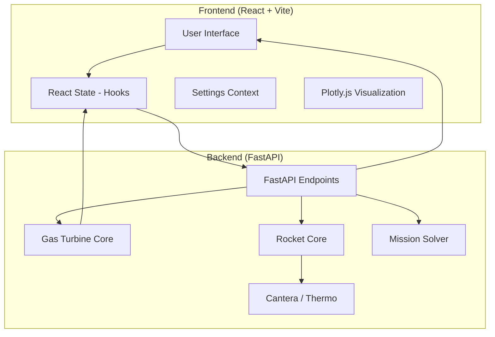

# System Architecture & Technical Wiki

## High-Level Architecture

The platform follows a decoupled client-server architecture.

## Data Flow & Processing Logic

### 1. Rocket Analysis Flow

When parameters are updated in the Rocket Analysis tab:

1. **Frontend**: Triggers `runAll()` which sends requests to `/analyze/rocket`, `/sweep`, and `/altitude`.
2. **Backend**: Instantiates a `RocketAnalyzer`.
   - **Equilibrium Solver**: Uses `Cantera` to minimize Gibbs free energy at chamber pressure ($P_c$).
   - **Nozzle Flow**: Propagates properties to the throat (isentropic Mach 1) and exit pressure ($P_e$).
   - **Bartz Heat Flux**: Computes $h_{gas}$ using the Bartz correlation based on local Reynolds and Mach numbers.
3. **Frontend**: Receives data and updates state. The `MetricCard` components compute $\Delta$ values if a baseline is active.

### 2. Gas Turbine Cycle Logic

- **Station Numbering**: Follows standard aerospace numbering (S0: Freestream, S2: Inlet, S21: Fan Exit, S3: HPC Exit, S4: HPT Inlet, S45: LPT Inlet, S5: Turbine Exit, S7: Augmentor, S9: Nozzle).
- **Cantera Thermodynamics**: Replaced constant gamma approximations with a temperature-dependent real-gas core (GRI 3.0). Every station transition evaluates property state vectors ($h, s, \gamma, C_p, mw$) based on enthalpy and pressure.
- **Mixer Logic**: Implements a mass-weighted enthalpy conservation model for mixed-exhaust turbofans.

## Component Hierarchy & State Management

### Persistence Strategy

- **LocalStorage Hooks**: The `MissionAnalysis` and `AircraftData` states are serialized and stored in browser `localStorage`. This ensures session continuity for complex aircraft design syntheses.
- **Settings Context**: Provides global access to theme, font scaling, and shared CSS variables.

### Plotting System

- **2D/3D Hybrid Rendering**: The MoC visualizer supports both 2D characteristic mesh rendering and revolving 3D surface plots via Plotly.
- **Revision Control**: Uses a `plotRevision` state to force UI updates during parameter shifts.
- **Theming**: Integrated with `getLayout()` helper to switch between dark/light layout tokens.

## Mathematical Models

### Bartz Heat Flux

Calculates convective heat transfer coefficient $h_g$:

$$h_g = \left[\frac{0.026}{D_t^{0.2}} \frac{\mu^{0.2} C_p}{Pr^{0.6}}\right] \left(\frac{P_c}{c^*}\right)^{0.8} \sigma$$

Where $\sigma$ is a correction for boundary layer properties.

### Method of Characteristics (MoC)

- Generates a shock-free supersonic nozzle contour for maximum thrust extraction.
- Maps internal expansion nodes to a grid for visualization.

## Future Extensibility

- **User Authentication**: Hooks already exist in `Settings.jsx` for cloud sync.
- **Mission Storage**: Planned persistence for aircraft configuration JSONs.
- **Multi-Propellant Comparison**: Extension of the current baseline logic to support N-way propellant overlays.
