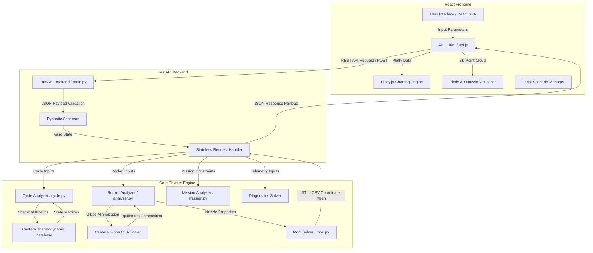

# Propulsion Analysis Suite

The Propulsion Analysis Suite is an integrated engineering environment for thermodynamic cycle analysis, chemical equilibrium combustion modeling, nozzle contour synthesis, and aircraft mission constraint design.

The system is built on a decoupled architecture, combining a stateless FastAPI python backend powered by Cantera with an interactive React frontend utilizing code-split Plotly visualizations.

---

## Core Engineering Modules and Mathematical Formulations

### 1. Gas Turbine Thermodynamic Cycle Engine
The cycle engine performs station-based thermodynamic analyses using temperature-dependent gas properties and chemical kinetics via the Cantera GRI30 mechanism. It supports multiple engine configurations including single-spool turbojets, multi-spool turbofans, and mixed-flow exhausts.

#### Station Definition and Gas Properties
Fluid properties (enthalpy, entropy, specific heats, and gas constants) are updated dynamically at each engine station using:
- T_total: Total Temperature
- P_total: Total Pressure
- f: Fuel-air ratio (at combustion and downstream stations)

#### Iterative Multi-Spool Solver
For multi-spool turbofans (Low-Pressure Spool and High-Pressure Spool), the HPT and LPT exit conditions are resolved iteratively to ensure work compatibility:
- High-Pressure Spool Work Balance:
  Work_HPT * eta_mech_HP = Work_HPC
- Low-Pressure Spool Work Balance:
  Work_LPT * eta_mech_LP = Work_LPC + (1 + BPR) * Work_Fan

The solver converges exit conditions to under 0.1% tolerance using an iterative fixed-point scheme with mid-point Cantera property updates.

#### Mixed-Exhaust Augmentation
For mixed-flow architectures, core and bypass flow properties are combined using a momentum-preserving mixer model to calculate mixed exhaust total temperature (Tt_mix) and total pressure (Pt_mix) before entering the augmentor/nozzle.

---

### 2. Rocket Propulsion Analysis and Nozzle Synthesis
The rocket analysis module computes chemical equilibrium performance and designs the geometric profile of the expansion nozzle.

#### Chemical Equilibrium (Fast Cantera CEA)
Combustion species mole fractions, flame temperature, chamber gas constant (R), and specific heat ratio (gamma) are calculated using Gibbs free energy minimization at a specified chamber pressure (Pc) and oxidizer-to-fuel (O/F) mass ratio.

#### Engine Sizing
Using the delivered specific impulse (Isp) and user-specified target thrust, the solver determines the mass flow rate (mdot), throat area (At), and nozzle exit area (Ae) for isentropic expansion to ambient pressure (Pe).

#### Bartz Heat Flux Model
Convective heat transfer coefficients (h_g) and wall heat fluxes (q) along the nozzle liner are evaluated using the semi-empirical Bartz relation:
h_g = [ (0.026 / D_t^0.2) * (mu_0^0.2 * C_p / Pr_0^0.6) * (P_c / c*)^0.8 * (D_t / D)^1.8 ] * sigma
where:
- D_t is the throat diameter
- P_c is the chamber pressure
- c* is the characteristic velocity
- mu, Cp, Pr are gas properties evaluated at stagnation conditions
- sigma is the boundary layer correction factor

#### Method of Characteristics (MoC) Nozzle Design
The nozzle expansion contour is synthesized using the Method of Characteristics for a minimum-length nozzle (MLN). The solver integrates characteristic curves along C+ and C- Mach lines:
dy/dx = tan(theta +/- mu)
where:
- theta is the local flow angle
- mu is the local Mach angle: mu = arcsin(1 / M)
The resulting contour points are exported directly as 3D meshes (STL) or 2D coordinate files (CSV).

---

### 3. Mission Constraint Synthesis
The mission analysis module evaluates thrust-to-weight ratio (T/W) versus wing loading (W/S) requirements for civil or military design specifications. It computes boundary constraints for:
- Stall Speed Limits:
  (W/S)_stall = 0.5 * rho_inf * V_stall^2 * C_L_max
- Takeoff Field Length:
  Expressed as a function of wing loading and thrust-to-weight ratio based on takeoff parameter correlations.
- Clean Cruise and High-Speed Dash:
  T/W = q_inf * [ C_D0 / (W/S) + k * (W/S) / q_inf^2 ]
- Climb Rate and Turn Performance:
  Evaluates constraints based on specific excess power (P_s) requirements.

---

### 4. Component Diagnostics Engine
The diagnostic engine evaluates component degradation and isolates faults from simulated test-cell or flight telemetry:
- Compressor Isentropic Efficiency:
  eta_c = (T_t2 * ((P_t3 / P_t2)^((gamma - 1) / gamma) - 1)) / (T_t3 - T_t2)
- Turbine Isentropic Efficiency:
  eta_t = (T_t4 - T_t5) / (T_t4 * (1 - (P_t5 / P_t4)^((gamma - 1) / gamma)))
- Combustor Pressure Loss:
  delta_P_b = (P_t3 - P_t4) / P_t3

Efficiency values below nominal thresholds generate fault flags:
- F01: Compressor Fouling (efficiency < 84%)
- F02: Turbine Erosion (efficiency < 86%)
- F03: Combustor Flow Restriction (pressure drop > 6%)

## System Architecture and Data Flow

The flow of data and control logic from the user interface down to the chemical database and characteristics solvers is mapped in the following diagram:



### Technical Stack
- **Backend**: FastAPI (Python 3.9+), Cantera (thermodynamics & chemistry), NumPy, SciPy, pandas, Pydantic (data validation).
- **Frontend**: React 19, Vite, Plotly.js (WebGL-accelerated charting and 3D nozzle visualization), Vanilla CSS.
- **Data Exchange**: RESTful API endpoints exchanging serialized JSON payloads. Local state persistence uses localStorage-backed React hooks.

---

## Program Features and Usage Guide

The suite contains five key engineering modules accessible via the left sidebar navigation:

### 1. Cycle Solver (Parametric Cycle Analysis)
- **Features**: Performs parametric thermodynamic sizing of Turbojet, Turbofan, and Mixed-Flow engines. Resolves fuel-air ratios, total temperatures, and pressures across nine distinct mechanical engine stations. Supports afterburners and multi-spool booster systems.
- **How to Use**:
  1. Select the engine type (e.g., Turbofan) from the top selector.
  2. Adjust input parameter sliders: flight altitude, flight Mach number, compressor overall pressure ratio (OPR), and turbine inlet temperature (T4).
  3. Toggle afterburners or LPC boosters as required.
  4. View the live thermodynamic station plot (P_total and T_total) and performance stats (Specific Thrust, TSFC, efficiencies).
  5. Save current parameters in the **Scenario Manager** at the bottom of the panel. Toggle **COMP** to overlay compared scenarios on the chart.

### 2. Map Matching (Off-Design Compressor Performance)
- **Features**: Generates compressor performance maps showing corrected mass flow and pressure ratios across multiple rotational speeds. Automatically overlays operating lines and identifies surge margins.
- **How to Use**:
  1. Open the Map Matching tab.
  2. Use the throttle sliders to adjust spool speeds and mass flows.
  3. Verify the operating point stays to the right of the surge limit curve.
  4. Examine speed lines (from 60% to 100% design RPM) to match compressor behavior with turbines under off-design throttle settings.

### 3. Chamber CEA (Rocket Propulsion Design Suite)
- **Features**: Combines Gibbs minimization equilibrium solver, isentropic nozzle sizing, Bartz convective heat flux analysis, and Method of Characteristics (MoC) 3D minimum-length nozzle generation.
- **How to Use**:
  1. Under the Chamber Design sub-tab, select a propellant combination (e.g., LOX / LH2 - Hydrolox).
  2. Set chamber pressure and O/F mass flow ratio.
  3. Enable **Engine Sizing** to scale throat and exit geometry to meet a specific target vacuum thrust.
  4. Run the synthesis. Review the 3D expansion nozzle profile and the Bartz convective heat flux curve.
  5. Select **Export Coordinates (CSV)** to download 2D wall coordinates with structured metadata, or **Export 3D Mesh (STL)** for CAD applications.
  6. Switch to **O/F Optimum** or **Altitude Performance** tabs to review sweep curves and atmospheric pressure regimes.

### 4. Mission Synthesis (Constraint Diagrams)
- **Features**: Synthesizes military and civil constraint equations (takeoff distance, clean cruise, landing distance, climb rate, and turning G-loads) to construct matching parameter space grids.
- **How to Use**:
  1. Input aerodynamic coefficients (C_D0, Oswald span efficiency factor k, and C_L_max) representing the aircraft geometry.
  2. Adjust runway length, climb rate targets, and cruise altitudes.
  3. Observe the constraint boundaries on the T/W vs W/S plot.
  4. The unshaded white region represents the valid design window; the optimal point is calculated at the intersection of the constraints.

### 5. Fault Isolation (Thermodynamic Diagnostics)
- **Features**: Real-time health monitoring of operational gas turbine components. Uses test-cell telemetry to calculate efficiency degradation.
- **How to Use**:
  1. Feed measured station data (temperatures and pressures at inlet, compressor exit, and turbine exit) using the input sliders.
  2. The diagnostics module isolates changes and computes deviations in isentropic efficiency.
  3. If degradation is isolated, it displays warning flags (`F01` to `F03`) and outlines remediation instructions.

---

## Getting Started

### Prerequisites
- Python 3.9+
- Node.js 18+
- C compiler (required by Cantera for runtime chemistry compilation)

### Directory Map
- `core/`: Core physics solvers (gas turbine cycles, rocket CEA, MoC nozzle calculations, mission constraints).
- `backend/`: FastAPI application server and JSON request routing.
- `frontend/`: React SPA containing pages and component assets.
- `docs/`: Technical manuals, design specs, and handover logs.

### Backend Installation and Execution
1. Navigate to the backend directory:
   ```bash
   cd backend
   ```
2. Install dependencies:
   ```bash
   pip install -r requirements.txt
   ```
3. Run the development server:
   ```bash
   python -m uvicorn main:app --reload
   ```
   The backend API runs at `http://127.0.0.1:8000`. You can verify API status with:
   `curl http://127.0.0.1:8000/health`

### Frontend Installation and Execution
1. Navigate to the frontend directory:
   ```bash
   cd frontend
   ```
2. Install Node modules:
   ```bash
   npm install
   ```
3. Run the development server:
   ```bash
   npm run dev
   ```
   The frontend serves at `http://localhost:5173` and proxies requests to port 8000.

---

## Verification and Testing

To execute the test suite and verify package health:

```bash
# Run backend test suite (115 unit + API tests)
pytest tests/ -v

# Run frontend linting and compilation checks
cd frontend && npm run lint && npm run build
```

---

## License

This project is licensed under the MIT License - see the LICENSE file for details.

---
*Developed for propulsion system design and diagnostics.*
