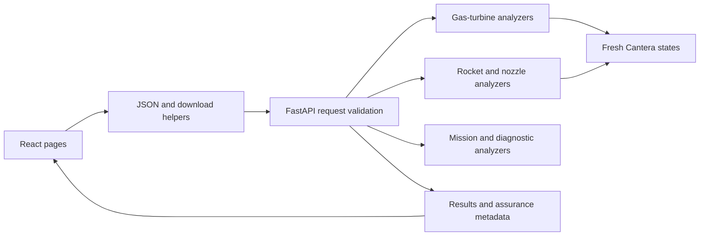

# Propulsion Analysis Suite

Propulsion Analysis Suite provides exploratory gas-turbine, rocket, and aircraft constraint calculations through a React interface and a FastAPI backend.

No complete model has an independently validated operating domain. Numerical convergence and passing tests do not qualify an engineering design.
See the [model credibility record](docs/engineering/MODEL_CREDIBILITY.md) and [release assurance decision](docs/engineering/EA08_RELEASE_REVIEW.md).

## Models and limits

| Area | Current capability | Main limit |
| --- | --- | --- |
| Legacy gas turbines | Approximate station calculations, separate/mixed exhaust, and measured spool residuals | Sampled properties and approximate composition. The recorded Mach-3 ramjet efficiency failure remains explicit. |
| Methane research | Ramjet, dry/wet turbojet, separate/mixed turbofan, and three-shaft turbofan | Pure methane with equilibrium burners and frozen components. No Jet-A equivalence or validated efficiency definition. |
| Rocket | GRI30 equilibrium, independent Pc/Pe/Pa, exact reactant mass ratios, and consistent throat/exit mass flux | 300 K gas reactants. RP1 uses a propane surrogate. Shifting throat pressure remains approximate. |
| Nozzle and thermal | Planar characteristic net, area mapping, mesh exports, and conceptual Bartz-style estimates | Area mapping is not an axisymmetric flow solution. Thermal and structural outputs are unqualified. |
| Generic off-design | Normalized maps, prescribed throttle schedules, and declared same-speed surge margin | No calibrated component maps or fixed-geometry engine matching. |
| Mission | Drag-polar constraints, ideal ground roll, and constant-condition Breguet examples | No obstacle-clearance or full mission prediction. Supplied-deck cruise is a separate API path. |
| Diagnostics | Telemetry validity checks and heuristic indicators | No calibrated fault classifier. Optional covariance propagation covers measurement uncertainty only. |

The atmosphere accepts geometric altitude from 0 to 47000 m and converts it to geopotential height.
Rocket exit design pressure Pe and ambient pressure Pa are independent. Altitude sweeps retain nozzle geometry.
Research mixers conserve mass, elements, and enthalpy with declared pressure loss. They do not solve a full mixer momentum field.

## Architecture


```mermaid
flowchart LR
    UI[React pages] --> Client[JSON and download helpers]
    Client --> API[FastAPI request validation]
    API --> GT[Gas-turbine analyzers]
    API --> Rocket[Rocket and nozzle analyzers]
    API --> Mission[Mission and diagnostic analyzers]
    GT --> Thermo[Fresh Cantera states]
    Rocket --> Thermo
    API --> Evidence[Results and assurance metadata]
    Evidence --> UI
```

Backend/core quantities use SI units unless a field name declares another unit.
The frontend converts values for display. Versioned scenario files declare SI inputs and model identity.
Each calculation uses isolated thermochemical states. Request handlers remain stateless.
See the [functional breakdown](functional_breakdown_diagram.md) for subsystem traceability.

## Local setup

Use Python 3.11 and Node 24 for alignment with CI. The tested Windows frontend runtime is Node 24.13.0 and npm 11.6.2.
Run these commands from the repository root:

```powershell
python -m venv .venv
.venv\Scripts\python.exe -m pip install -r backend/requirements.txt
.venv\Scripts\python.exe -m uvicorn backend.main:app --reload
```

In a second terminal:

```powershell
cd frontend
npm ci
npm run dev
```

The frontend starts at http://localhost:5173. The default API URL is http://127.0.0.1:8000.
Set VITE_API_URL to select another backend. Requests use that URL directly.
The `/health` endpoint checks API availability. It does not certify model accuracy.

## Scenarios, presets, and evidence

1. Select the page and model.
2. Review the input units and model limits.
3. Calculate the result and inspect the solver assurance panel.
4. Export the scenario to retain reusable inputs.
5. Export result and assurance to retain numerical evidence.

Preset names identify illustrative starting points. Independent sources are not recorded.
The interface applies supported fields and lists omitted fields. Edited inputs can differ from the original preset.
Imports check schema, units, field types, and page identity. Rejected files preserve inputs and invalidate old results.
Charts preserve gaps for unavailable points. Sweep exports retain failed points and their status.
See the [interface guide](docs/engineering/EA07_INTERFACE_GUIDE.md) for migration rules and scope limits.

## Verification

```powershell
.venv\Scripts\python.exe -m pip install pytest pytest-cov httpx
.venv\Scripts\python.exe -m pytest tests/ -q --cov=core
.venv\Scripts\python.exe tools/validate_references.py
cd frontend
npm run lint
npm test
npm run build
npx playwright test
```

Browser tests require the Playwright Chromium runtime. Use `npx playwright install chromium` from frontend/ when it is absent.
The runner starts dedicated local API and frontend servers on ports 8000 and 5188.
CI also checks dependency consistency and advisories, then retains test and reference evidence as artifacts.
Configured CI steps do not imply that a remote run passed for an uncommitted workspace.

## Engineering records

- [Sprint plan](docs/ENGINEERING_ASSURANCE_SPRINT_PLAN.md)
- [EA-06 physics scope and limits](docs/engineering/EA06_CLOSEOUT.md)
- [EA-07 interface closeout](docs/engineering/EA07_CLOSEOUT.md)
- [EA-08 release review](docs/engineering/EA08_RELEASE_REVIEW.md)
- [Current handoff](HANDOFF.md)

## License

See [LICENSE](LICENSE).

The chart runtime uses the official Plotly GL3D bundle. Geographic map traces are intentionally excluded.
See [EA08-R01 remediation](docs/engineering/EA08_REMEDIATION.md) for the dependency boundary.
