# Systems Engineering Functional Breakdown Diagram (FBD)

```mermaid
graph TD
    %% Core System Architecture
    SubGraph_System["Propulsion Analysis Suite"]

    %% Backend Subsystem
    subgraph Backend ["FastAPI Microservice Layer"]
        API_Endpoints["REST Endpoints (/analyze/*, /presets, /health)"]
        Preset_Manager["Preset Repository (core/presets.py)"]
        Diagnostics_Kernel["Telemetry Assessment (core/diagnostics.py)"]
        Error_Gateway["Request ID & Safe Error Handlers (backend/errors.py)"]
        CORS_Security["CORS & Origin Security Filter (backend/main.py)"]
        Dependency_Gate["Python Dependency Gate (FastAPI/Starlette pins & pip-audit)"]
    end

    %% Solvers Subsystem
    subgraph Solvers ["Physics & Thermodynamic Solvers"]
        Assurance["Result Status and Typed Failures (core/solver_result.py, core/errors.py)"]
        Atmosphere["Bounded Atmosphere: 0-47 km (core/units.py)"]
        Cycle_Analyzer["CycleAnalyzer (Gas Turbine & Ramjet)"]
        OffDesign_Solver["OffDesignSolver (Generic Map Schedule)"]
        Mission_Analyzer["MissionAnalyzer (Constraint Diagrams & Breguet Range)"]
        Rocket_Analyzer["RocketAnalyzer (Gibbs Minimization Equilibrium & Bartz Heat Flux)"]
        MoC_Nozzle["MoCNozzle (Method of Characteristics, STL & Wavefront OBJ 3D)"]
    end

    %% Frontend Subsystem
    subgraph Frontend ["React SPA Application"]
        App_Shell["App Shell & Navigation (App.jsx)"]
        Blueprint_Diag["Engine Blueprint Heatmap (EngineBlueprintDiagram.jsx)"]
        Preset_Modal["Preset Selector Modal (PresetSelectorModal.jsx)"]
        Shortcut_Modal["Keyboard Shortcuts Overlay (KeyboardShortcutsModal.jsx)"]
        Unit_System["Unit Conversion Matrix (unitConversion.js)"]
        Plotly_Engine["Interactive Charting Engine (Plotly.js)"]
        Api_Core["Timeout & Abort API Core (apiCore.js)"]
        Error_Boundary["Render Recovery Boundary (ErrorBoundary.jsx)"]
    end

    %% Verification & Test Automation Subsystem
    subgraph Verification ["Automated Test & Verification Suite"]
        Reference_Cases["Frozen Sources and Model Registry (docs/engineering/*.json)"]
        Reference_Runner["Independent Comparisons (tools/validate_references.py)"]
        Evidence_Report["Comparison Results and Explicit Validation Gaps"]
        Reference_Cases --> Reference_Runner
        Reference_Runner --> Evidence_Report
        Pytest_Suite["Backend Unit & Integration Suite (pytest; counts in VALIDATION_REPORT.md)"]
        Frontend_Unit["Frontend Core Mock Suite (5 Tests / node:test)"]
        Playwright_E2E["Playwright E2E Suite (Chromium; counts in VALIDATION_REPORT.md)"]
    end

    %% Data Flow Connections
    App_Shell --> Unit_System
    App_Shell --> Preset_Modal
    App_Shell --> Shortcut_Modal
    App_Shell --> Api_Core
    API_Endpoints --> Preset_Manager
    API_Endpoints --> Error_Gateway
    API_Endpoints --> CORS_Security
    Dependency_Gate --> API_Endpoints
    API_Endpoints --> Diagnostics_Kernel
    Cycle_Analyzer --> Assurance
    Rocket_Analyzer --> Assurance
    OffDesign_Solver --> Assurance
    Assurance --> Error_Gateway
    Cycle_Analyzer --> Atmosphere
    Rocket_Analyzer --> Atmosphere
    API_Endpoints --> Cycle_Analyzer
    API_Endpoints --> OffDesign_Solver
    API_Endpoints --> Mission_Analyzer
    API_Endpoints --> Rocket_Analyzer
    API_Endpoints --> MoC_Nozzle
    Blueprint_Diag --> Unit_System
    Plotly_Engine --> App_Shell
    App_Shell --> Error_Boundary
    Api_Core --> API_Endpoints
    Error_Gateway --> Api_Core
    Playwright_E2E --> App_Shell
    Playwright_E2E --> API_Endpoints
    Pytest_Suite --> API_Endpoints
    Pytest_Suite --> Solvers
    Frontend_Unit --> Api_Core
```

## Quantitative Subsystem Breakdown

| Subsystem Module | File Location | Key Capabilities | Output Artifacts / Verification Gate |
| --- | --- | --- | --- |
| **Gas Turbine Cycle** | `core/gas_turbine/cycle.py` | SLS/altitude design, turbofan separate/mixed, ramjet shock recovery | Temperatures, pressures, TSFC, specific thrust (verification evidence in docs/engineering/VALIDATION_REPORT.md) |
| **Off-Design Solver** | `core/gas_turbine/off_design.py` | Compressor map matching, throttle sweeps | Operating lines, surge margin (verification evidence in docs/engineering/VALIDATION_REPORT.md) |
| **Rocket CEA & MoC** | `core/rocket/analyzer.py`, `moc.py` | Chemical equilibrium, Bartz heat flux, supersonic nozzle MoC | 2D mesh, STL 3D solid, OBJ 3D mesh (verification evidence in docs/engineering/VALIDATION_REPORT.md) |
| **Mission Synthesis** | `core/gas_turbine/mission.py` | Constraint diagram synthesis (T/W vs W/S), Breguet range | Sizing corner, payload-range curve (verification evidence in docs/engineering/VALIDATION_REPORT.md) |
| **Fault Diagnostics** | `core/diagnostics.py` | Telemetry validity and constant-gamma efficiency screening | Threshold observations and explicit input rejection (evidence in docs/engineering/EA04_REPORT.md) |
| **API Error Boundary** | `backend/errors.py` | Request IDs, validation envelope, safe 5xx responses | Correlated JSON error payloads, sanitized server traces |
| **CORS & Dev Security** | `backend/main.py` | Regex-backed origin filter, exposed Request ID headers | Zero cross-origin blocks for multi-port testing |
| **Frontend Recovery Core** | `frontend/src/apiCore.js`, `ErrorBoundary.jsx` | Timeout/abort normalization and module recovery | Retryable user-safe errors, resettable fallback UI |
| **Playwright E2E Suite** | `frontend/e2e/*.spec.js` | 7 domain test suites covering all user interactions & downloads | 26 / 26 End-to-End browser test passes |
| **Pytest Physics Suite** | `tests/test_*.py` | 134 unit and integration tests for thermodynamics & APIs | 134 / 134 pytest test passes |

## EA-00 through EA-03 assurance trace

Cycle, rocket equilibrium/altitude, and off-design map/schedule results carry additive assurance metadata.
Expected solver failures pass through `backend/errors.py`. `SolverStatus.jsx` shows validity and exports the result with metadata.
Cycle sweeps preserve failed points. Rocket altitude calculations preserve nozzle geometry and vary ambient pressure within 0-47 km.
Off-design axes use normalized corrected flow. TSFC uses SI internally and converts only for display.
`tests/test_solver_assurance.py` checks residuals, domain failures, pressure thrust, fixed geometry, map anchoring, and SI units.
Mission and diagnostics now expose assurance metadata. MoC convergence metadata and independent model validation remain later scope.

## EA-04 contract update

Mission synthesis preserves point statuses and excludes failed constraints from the sampled optimum.
Takeoff uses an ideal SI ground-roll lower bound. Breguet supports explicit mass-flow and weight-flow SFC units.
Diagnostics reject contradictory telemetry before threshold comparison. Screening results do not establish mechanical causes or safety.
See `docs/engineering/EA04_REPORT.md` and `tests/test_mission_assurance.py` for equations and evidence.

## EA-05 evidence flow

The offline reference runner reads frozen primary-source cases and executes the existing atmosphere and MoC functions.
It records actual values, tolerances, differences, source hashes, and incompatible definitions in EA05_COMPARISONS.json.
MODEL_REGISTRY.json covers 11 model groups. No complete model has an independently validated operating domain.
EA-06 corrects the geometric-altitude discrepancies through conversion to geopotential height. See EA06_REPORT.md.

## EA-06 atmosphere correction

All existing atmosphere callers supply geometric altitude by default.
`core/units.py` converts this input to geopotential height before it selects a standard layer.
The reference adapter selects each frozen table convention explicitly.
`tests/test_atmosphere_conventions.py` checks layer continuity and convention limits.

## EA-06 rocket reactants

Rocket requests define oxidizer mass divided by total fuel-stream mass, including impurities.
The analyzer aggregates species masses and sets Cantera TPY before chamber equilibrium.
Results expose reactant mass fractions, temperature, pressure, enthalpy, and phase for reference comparisons.
Equivalence ratio is derived from this state. Rounded catalog ratios no longer control chemistry.

## EA-06 cycle energy audit

`tools/audit_cycle_energy.py` reads cycle states and measures inlet and frozen-proxy nozzle energy residuals.
It records actual proxy mass ratios and retains solver failure diagnostics in `docs/engineering/EA06_CYCLE_ENERGY.json`.
This diagnostic path does not alter production solver behavior.
The cycle proposal defines separate thermodynamic state, inlet/nozzle, burner, shaft, mixer, and interface gates.

## EA-06 GT-A thermodynamic states

`core/gas_turbine/state.py` converts species masses to immutable GRI30 state snapshots.
Each TP, HP, or SP operation owns a fresh solution and retains composition.
These helpers feed future GT-B inlet and nozzle calculations. The legacy cycle path does not call them yet.
`tests/test_gas_state.py` checks mass and element conservation, state inversion, and concurrent isolation.

## EA-06 GT-B frozen flow

`core/gas_turbine/flow.py` consumes GT-A states for freestream and convergent nozzle calculations.
It returns immutable flow results with energy residuals and sonic convergence evidence.
The inlet uses an HP inversion. The nozzle uses a bounded sonic root and frozen SP expansion.
These helpers feed GT-C. They do not replace the legacy API path yet.

## EA-06 GT-C methane research path

`core/gas_turbine/methane.py` connects GT-A states, the GT-B inlet, a lean equilibrium burner, and the frozen convergent nozzle.
A bounded fuel root enforces the formation-enthalpy balance and records element residuals.
The result contains mass and momentum outputs plus component evidence. Efficiency metrics remain unavailable pending review.
The legacy API path is unchanged. Model selection remains GT-F work.

## EA-06 GT-D shaft stages

`core/gas_turbine/shaft.py` uses frozen GT-A states for compressor and turbine stages.
SP states define isentropic work. HP states enforce actual work with explicit isentropic efficiencies.
A bounded pressure root matches each shaft demand on a core-air mass basis.
The HP/LP evidence case connects two compressors, the GT-C burner, and two sequential turbines.
The legacy API solver is unchanged.

## EA-06 GT-E mixer and afterburner

`core/gas_turbine/mixer.py` sums species and enthalpy flows, then creates a frozen HP outlet state.
`methane_afterburner` bounds added fuel by excess inlet oxygen and solves equilibrium reheat through a shared combustion helper.
The mixer reports W and kg/s residuals. The afterburner reports residuals per kg of inlet gas.
GT-F will connect these research interfaces to explicit model selection. The legacy API remains unchanged.

## EA-06 GT-F ramjet interface

`MethaneRamjet.jsx` submits an explicit model identifier to `/analyze/cycle/methane-ramjet`.
`MethaneRamjetRequest` rejects unknown legacy fields. The handler converts altitude and calls the methane research core.
The UI displays component evidence and exports model-specific scenarios and full assurance results.
Other research engine architectures remain internal helper sets pending assembly and API adoption.

## EA-06 GT-F methane turbojet

The research panel selects `/analyze/cycle/methane-turbojet` with its own model identifier and scenario schema.
The core connects inlet, compressor, methane burner, matched turbine, and frozen nozzle stages.
Shaft work uses the core-air mass basis and includes product mass and mechanical loss.
The UI adds stage controls, turbine state, shaft residual, and model-specific exports.

## EA-06 GT-F turbojet afterburner

The methane turbojet optionally connects the matched turbine outlet to the GT-E afterburner before nozzle expansion.
Added fuel converts from inlet-gas mass to core-air mass before TSFC and nozzle flow calculations.
The UI and API expose nullable afterburner temperature, pressure loss, and heat loss.
Dry scenarios preserve disabled reheat. Exports retain wet component states and fuel accounting.

## EA-06 completion interfaces

- Research GT selection connects strict model requests to ramjet, turbojet, separate/mixed turbofan, and three-shaft paths.
- `core/gas_turbine/turbofan.py` owns fan/booster/HPC work, HP/IP/LP matching, stream mixing, and independent nozzle flows.
- Rocket sizing uses throat mass flux for c-star and area. Frozen flow uses the sonic root.
- `core/gas_turbine/map_contract.py` defines dimensional corrected map interpolation without extrapolation or engine matching.
- `/analyze/mission/cruise-deck` connects a supplied installed-engine deck to constant-condition cruise segments.
- Optional `input_covariance` on `/analyze/diagnostics` connects telemetry to first-order measurement uncertainty.
- Calibration, full axisymmetric MoC, cooling extensions, and qualification remain outside the completed selected upgrades.

## EA-07 scenario interface: 2026-09-09

`frontend/src/utils/scenario.js` owns the versioned input envelope and compatibility checks.
`MethaneRamjet.jsx` applies architecture-specific input validation and the existing request sequence guard.
Scenario imports clear old result evidence. Rejected files retain current inputs and display an error.
Scenario exports declare SI units and model identity. Result assurance remains a separate export.
See `docs/engineering/EA07_PLAN.md` for migration limits and remaining interface gates.

## EA-07 consolidated engineering interfaces: 2026-09-09

- `data/pageDefaults.js` defines editable legacy page inputs and declared migration defaults.
- `utils/scenario.js` checks schema, page identity, units, field names, and field types.
- `hooks/useJsonScenario.js` controls import errors, file-read ordering, provenance, and evidence invalidation.
- `utils/presetApplication.js` maps supported preset fields and converts rocket pressure from bar to Pa.
- `App.jsx` applies the mapped inputs and remounts the selected page. `ScenarioSource.jsx` displays source limits and omitted fields.
- `EngineeringPlot.jsx` owns shared Plotly construction and enforces gaps for unavailable numeric data.
- `SolverStatus.jsx` displays model evidence. `resultExport.js` adds export metadata while preserving numerical values and assurance.
- `SweepStatus.jsx` preserves failed rows and exports per-point metadata.

No solver equations or backend interfaces change in EA-07. See `docs/engineering/EA07_PLAN.md` for the acceptance gates.

## EA-08 assurance gate: 2026-09-09

The CI workflow executes backend regression, independent comparisons, frontend contracts, build, dependency audits, and Chromium regression.
It retains backend and browser evidence as workflow artifacts.
The Playwright configuration selects the local Windows virtual environment or the CI Python interpreter.
EA08_RELEASE_REVIEW.md records the release hold, dependency finding EA08-R01, and unexecuted remote CI gate.
No calculation behavior changes in this review.

## EA08-R01 chart runtime boundary

`chartRuntime.js` owns the official GL3D Plotly runtime. `EngineeringPlot.jsx` supplies it to the React factory.
The npm alias replaces both the full distribution and the full-source peer dependency. Geographic map traces are excluded.
`chart_bundle.spec.js` checks retained engineering traces and absent map trace registration.
See `docs/engineering/EA08_REMEDIATION.md` for the security boundary and artifact evidence.
