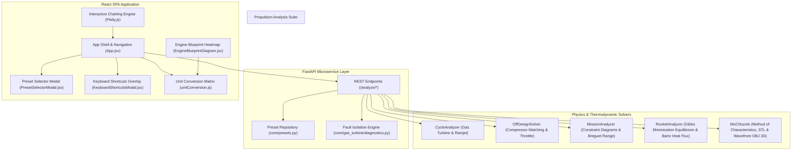

# Systems Engineering Functional Breakdown Diagram (FBD)

## Quantitative Subsystem Breakdown

| Subsystem Module | File Location | Key Capabilities | Output Artifacts |
| --- | --- | --- | --- |
| **Gas Turbine Cycle** | `core/gas_turbine/cycle.py` | SLS/altitude design, turbofan separate/mixed, ramjet shock recovery | Temperatures, pressures, TSFC, specific thrust |
| **Off-Design Solver** | `core/gas_turbine/off_design.py` | Compressor map matching, throttle sweeps | Operating lines, surge margin |
| **Rocket CEA & MoC** | `core/rocket/analyzer.py`, `moc.py` | Chemical equilibrium, Bartz heat flux, supersonic nozzle MoC | 2D mesh, STL 3D solid, OBJ 3D mesh |
| **Mission Synthesis** | `core/gas_turbine/mission.py` | Constraint diagram synthesis (T/W vs W/S), Breguet range | Sizing corner, payload-range curve |
| **Fault Diagnostics** | `core/gas_turbine/diagnostics.py` | EGT margin loss, compressor fouling, turbine erosion isolation | Fault signature radar, recommended maintenance |
