# Systems Engineering Functional Breakdown Diagram (FBD)

```mermaid
graph TD
    %% Core System Architecture
    SubGraph_System["Propulsion Analysis Suite"]

    %% Backend Subsystem
    subgraph Backend ["FastAPI Microservice Layer"]
        API_Endpoints["REST Endpoints (/analyze/*, /presets, /health)"]
        Preset_Manager["Preset Repository (core/presets.py)"]
        Diagnostics_Kernel["Fault Isolation Engine (core/gas_turbine/diagnostics.py)"]
        Error_Gateway["Request ID & Safe Error Handlers (backend/errors.py)"]
        CORS_Security["CORS & Origin Security Filter (backend/main.py)"]
        Dependency_Gate["Python Dependency Gate (FastAPI/Starlette pins & pip-audit)"]
    end

    %% Solvers Subsystem
    subgraph Solvers ["Physics & Thermodynamic Solvers"]
        Cycle_Analyzer["CycleAnalyzer (Gas Turbine & Ramjet)"]
        OffDesign_Solver["OffDesignSolver (Compressor Matching & Throttle)"]
        Mission_Analyzer["MissionAnalyzer (Constraint Diagrams & Breguet Range)"]
        Rocket_Analyzer["RocketAnalyzer (Gibbs Minimization Equilibrium & Bartz Heat Flux)"]
        MoC_Nozzle["MoCNozzle (Method of Characteristics, STL & Wavefront OBJ 3D)"]
    end

    %% Frontend Subsystem
    subgraph Frontend ["React SPA Application"]
        App_Shell["App Shell & Navigation (App.jsx)"]
        Blueprint_Diag["Engine Blueprint Heatmap (EngineBlueprintDiagram.jsx)"]
        Preset_Modal["Preset Selector Modal (PresetSelectorModal.jsx)"]
        Shortcut_Modal["Keyboard Shortcuts Overlay (KeyboardShortcutsModal.jsx)"]
        Unit_System["Unit Conversion Matrix (unitConversion.js)"]
        Plotly_Engine["Interactive Charting Engine (Plotly.js)"]
        Api_Core["Timeout & Abort API Core (apiCore.js)"]
        Error_Boundary["Render Recovery Boundary (ErrorBoundary.jsx)"]
    end

    %% Verification & Test Automation Subsystem
    subgraph Verification ["Automated Test & Verification Suite"]
        Pytest_Suite["Backend Unit & Integration Suite (134 Tests / pytest)"]
        Frontend_Unit["Frontend Core Mock Suite (5 Tests / node:test)"]
        Playwright_E2E["Playwright E2E Suite (26 Tests / Chromium Engine)"]
    end

    %% Data Flow Connections
    App_Shell --> Unit_System
    App_Shell --> Preset_Modal
    App_Shell --> Shortcut_Modal
    App_Shell --> Api_Core
    API_Endpoints --> Preset_Manager
    API_Endpoints --> Error_Gateway
    API_Endpoints --> CORS_Security
    Dependency_Gate --> API_Endpoints
    API_Endpoints --> Diagnostics_Kernel
    API_Endpoints --> Cycle_Analyzer
    API_Endpoints --> OffDesign_Solver
    API_Endpoints --> Mission_Analyzer
    API_Endpoints --> Rocket_Analyzer
    API_Endpoints --> MoC_Nozzle
    Blueprint_Diag --> Unit_System
    Plotly_Engine --> App_Shell
    App_Shell --> Error_Boundary
    Api_Core --> API_Endpoints
    Error_Gateway --> Api_Core
    Playwright_E2E --> App_Shell
    Playwright_E2E --> API_Endpoints
    Pytest_Suite --> API_Endpoints
    Pytest_Suite --> Solvers
    Frontend_Unit --> Api_Core
```

## Quantitative Subsystem Breakdown

| Subsystem Module | File Location | Key Capabilities | Output Artifacts / Verification Gate |
| --- | --- | --- | --- |
| **Gas Turbine Cycle** | `core/gas_turbine/cycle.py` | SLS/altitude design, turbofan separate/mixed, ramjet shock recovery | Temperatures, pressures, TSFC, specific thrust (100% verified) |
| **Off-Design Solver** | `core/gas_turbine/off_design.py` | Compressor map matching, throttle sweeps | Operating lines, surge margin (100% verified) |
| **Rocket CEA & MoC** | `core/rocket/analyzer.py`, `moc.py` | Chemical equilibrium, Bartz heat flux, supersonic nozzle MoC | 2D mesh, STL 3D solid, OBJ 3D mesh (100% verified) |
| **Mission Synthesis** | `core/gas_turbine/mission.py` | Constraint diagram synthesis (T/W vs W/S), Breguet range | Sizing corner, payload-range curve (100% verified) |
| **Fault Diagnostics** | `core/gas_turbine/diagnostics.py` | EGT margin loss, compressor fouling, turbine erosion isolation | Fault signature radar, recommended maintenance (100% verified) |
| **API Error Boundary** | `backend/errors.py` | Request IDs, validation envelope, safe 5xx responses | Correlated JSON error payloads, sanitized server traces |
| **CORS & Dev Security** | `backend/main.py` | Regex-backed origin filter, exposed Request ID headers | Zero cross-origin blocks for multi-port testing |
| **Frontend Recovery Core** | `frontend/src/apiCore.js`, `ErrorBoundary.jsx` | Timeout/abort normalization and module recovery | Retryable user-safe errors, resettable fallback UI |
| **Playwright E2E Suite** | `frontend/e2e/*.spec.js` | 7 domain test suites covering all user interactions & downloads | 26 / 26 End-to-End browser test passes |
| **Pytest Physics Suite** | `tests/test_*.py` | 134 unit and integration tests for thermodynamics & APIs | 134 / 134 pytest test passes |
